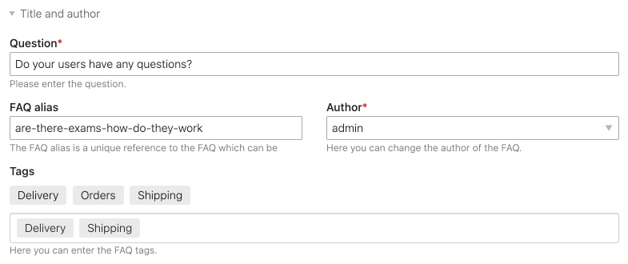

# FAQ Tags bundle for Contao Open Source CMS

FAQ Tags is a bundle for the [Contao Open Source CMS](https://contao.org).

The extension provides the tagging functionality for the [FAQ bundle](https://github.com/contao/faq-bundle) in Contao. 
It uses the [codefog/tags-bundle](https://github.com/codefog/tags-bundle) bundle behind the scenes. Find more 
information about the features in the documentation below.

## Documentation

1. [Installation](docs/01-installation.md)
2. [Backend UI](docs/02-backend-ui.md)
3. [Frontend modules](docs/03-frontend-modules.md)

## Copyright

This project has been created and is maintained by [Codefog](https://codefog.pl).
